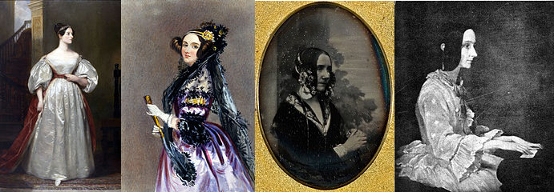
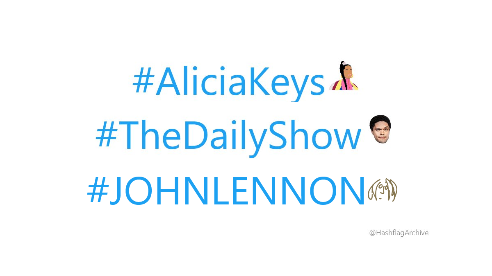
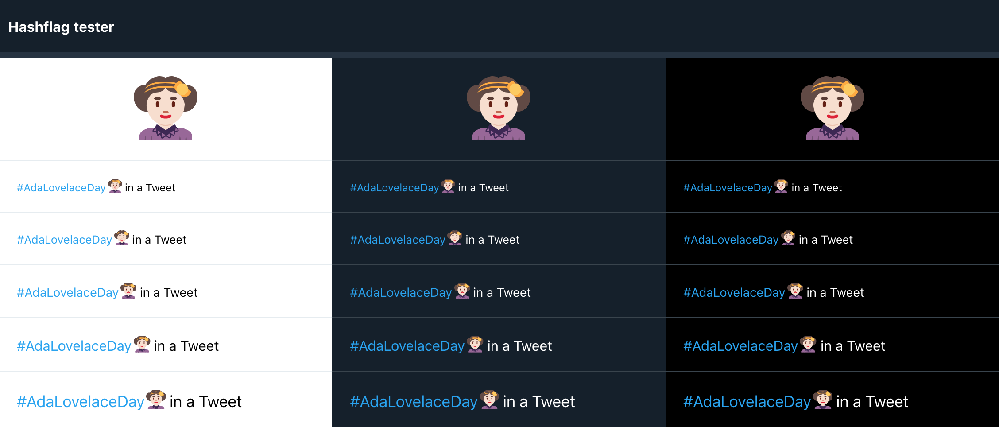
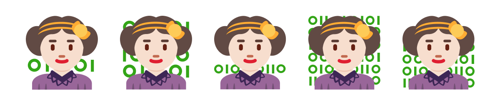
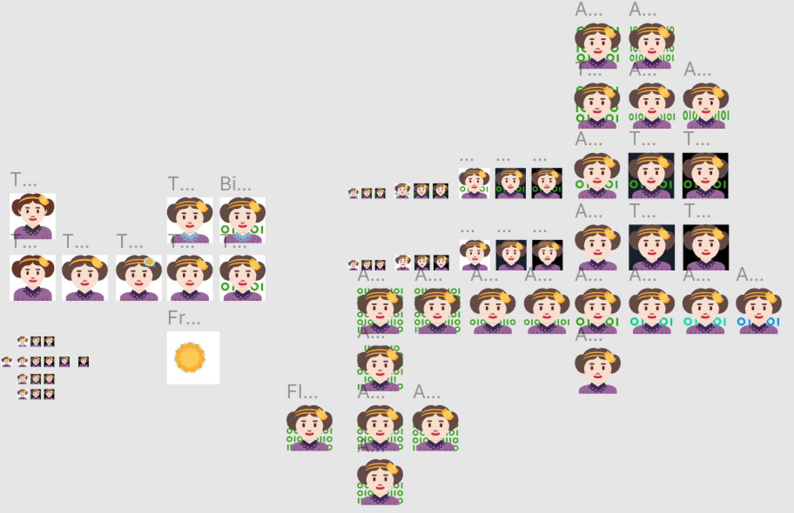

If you're on Twitter on 13th October 2020, you might notice:

Yes, that's Ada Lovelace as an emoji.

[#AdaLovelaceDay](https://twitter.com/hashtag/AdaLovelaceDay) celebrates and highlights the achievements of women in STEM and the story of a pioneering computer scientist. As a woman in STEM, I was lucky enough to get to design the emoji for the hashflag. 

This blog looks at the constraints of designing a hashflag, the choices in how to represent Ada Lovelace, the compatibility and visibility requirements, and why any of this matters. I also built a hashflag tester, if you’re just here for the web apps. 

## #AdaLovelaceDay?

Ada Lovelace Day is an international celebration of the achievements of women in STEM, [kicked off in 2009 by the fab Suw Charman-Anderson](https://findingada.com/about/history-of-ada-lovelace-day/) to increase the profile of women in STEM and the pioneering computer scientist the day is named after. 

Ada Lovelace was a boss. She wrote the first published computer algorithm before computers even existed. And she was able to see the potential of computing - beyond just calculations with numbers; but as something with huge potential across society. She did all that in the 1800s, living to just 36, and then was mainly forgotten for 100 years - only to have people try to play down her contributions to computing. And people wonder why we need to fight for women in STEM. So on Ada Lovelace Day this year, folks will be tweeting, talking, Zooming (it is 2020) and more to celebrate Ada Lovelace and the achievements of the many exceptional women in STEM today.

## What is a hashflag?

A hashflag is when a hashtag on Twitter gets a little emoji automatically added at the end. 

<blockquote class="twitter-tweet" data-dnt="true">
it’s a hashtag but with a emoji
&mdash; rev (@jinkisjongg) <a href="https://twitter.com/jinkisjongg/status/1303159433606737920?ref_src=twsrc%5Etfw">September 8, 2020</a></blockquote> 

From a design perspective, this means it’s teeny tiny - here are the specs:

- Square image - provide 72x72px, but potentially displayed as small as 16x16px
- Colours that are visible on both light and dark backgrounds
- Twitter recommends occupying as much of the canvas as possible, aiming for simplicity & creativity

## Which Ada Lovelace?

Ada Lovelace lived in the 1800s so there aren’t a lot of photos around. There are really only four main images of Lovelace as an adult from the time she was alive. Three paintings, and a single photograph: [^1]

A few things are consistent between them:

- A fancy hairdo involving some draping hair a the sides
- A hair accessory with a floral theme (two of them constructed with two bands in a bright colour and large flowers)
- Lace

But there’s quite a lot of variation too. So I looked into how others had thought about this.

### How else have people chosen to represent Ada?

From [Doctor Who](https://www.youtube.com/watch?v=dybZODHG7MQ) to [children's books](http://www.zafoukoyamamoto.com/books) to [The Thrilling Adventures of Lovelace and Babbage](https://en.wikipedia.org/wiki/The_Thrilling_Adventures_of_Lovelace_and_Babbage) to [the socks I'm wearing](https://www.chattyfeet.com/products/science-gifts-funny-socks-ada-shoe-lace), it's exciting to see more representation of Ada Lovelace in creative work.

There seem to be two broad approaches:
1) Taking a more toned down, naturalistic approach that perhaps most reflects the painting of Lovelace at the piano by Thomas Phillips shortly before her death.
2) Leaning heavily on the portrait, thought to be by Edward Chanlon, that has become the iconic image of Ada Lovelace - in flamboyant purple.

### What should we go for?

It’s a small space and it needs to be identifiable from a distance - this leans towards an iconic image over historical realism. It also appears reflective of the truth: Lovelace seems to have chosen to be represented in a high fashion way in multiple portraits, and the one photograph of her has one hell of a hair accessory. Women in STEM shouldn't have to look boring or conforming, or indeed any way at all, to be taken seriously - why dull down that flair?

## Style choice: Twemoji

[Twemoji](https://twemoji.twitter.com/) is the Twitter-created open source emoji library they use to make standard emojis on Twitter.

It’s not a requirement of a hashflag to use Twemoji or conform to that style. [@HashflagArchive](https://twitter.com/hashflagarchive) shows the varied style of previous hashflag emojis:

The first version of the Adamoji (sorry, needed a catchier shorthand) came about as part of the [Comuzi](https://www.comuzi.xyz/) x [Ada Lovelace Institute](https://www.adalovelaceinstitute.org/) work on [the A.D.A. bot](https://adabot.netlify.app/). Talking with Alex and Akil from Comuzi, we had visions of a pixel art or emoji vibe - a modern-retro feel to make history and computing feel accessible and engaging. 

After plenty of deconstructing existing Twemoji and tweaking SVGs[^2] I settled on:

It was this image of Ada Lovelace that captured the team at Twitter's imagination when I reached out - they wanted to make the #AdaLovelaceDay hashflag happen.

Three things gave me confidence in maintaining the design direction:

1. **Legibility** - the Twemoji library was designed with the constraints of the Twitter UI and emoji sizes in mind; it gave a starting point that met our key criteria of being clear and identifiable at small sizes
2. **Consistency** - Twemoji look like they belong on Twitter; there are some great innovative hashflag designs (big fan of [#AliciaKeys](https://twitter.com/HashflagArchive/status/1273829110633181184)) that use different styles and still look great, but there are also some that, to me, look out of place; we had a starting point that fit
3. **Fun and excitement** - the original image had already sparked with folks; there didn't seem a good case for moving too far from it

## Compatibility and visibility: building a hashflag tester

Now we knew it’d be used on Twitter.com I needed a way to consider how it would look in context.

This is where I admit it got a bit out of hand; I was an engineer faced with a design problem and too lazy to copy and paste little Adas in Figma many times...

### Presenting: the Hashflag Tester

I built a [little web app on Glitch](https://hashflag.glitch.me/)[^3] to test hashflags against the available font size and background colour combinations on Twitter.com, and easily share them with others to review.

This prompted a few key changes:

- Bigger head, smaller body - to make more visible at small sizes
- Lighter hair colour to make visible versus dark backgrounds, but still give overall sense of dark brown-black hair
- Collar colour - after a couple of variations, I found the dark lace collar, whilst less legible as a collar on dark backgrounds, made the head pop, making it easier to identify as a person at the smallest sizes
- Two-lined headband didn't affect legibility, and looked more true to the portraits and photo

## Contextualising Ada: binary

One of the goals of Ada Lovelace Day is to raise the profile of women in STEM around the world - if people don’t know who Ada Lovelace is, how do we give that context? 

This is the first published computer program, written before a computer even existed! But Ada Lovelace’s pioneering program doesn’t look like popular representations of code or programming today. 

Thanks to The Matrix and every TV show or movie where a character has claimed to be hacking into the CIA whilst the code on the screen only does basic sums,[^3] green binary or text on a dark background has become representative of 'doing something clever with algorithms'. 

Both Lovelace's program and modern programming languages proved pretty hard to represent in a tiny emoji, but binary was just simple enough:

### But Lovelace’s program was in decimal...

Yes, I know. Two things: 1) the digits in binary are a subset of decimal 2) communication matters more than historical accuracy here - if I’d put a range of numbers, would it have been comprehensible or related to computing in the minds of folks in 2020?

## It's live! Happy Ada Lovelace Day!

This Ada Lovelace emoji will appear next to the hashtags #AdaLovelace, #AdaLovelaceDay, #ALD20 and #ALD2020 on 13th October 2020. I hope it will help amplify the work of women in STEM today and introduce new people to Ada's story. 

<a href="https://twitter.com/intent/tweet?button_hashtag=AdaLovelaceDay&ref_src=twsrc%5Etfw" class="twitter-hashtag-button" data-dnt="true" data-show-count="false">Tweet #AdaLovelaceDay</a>

There are many folks around the world elevating, bringing together, supporting, encouraging and fighting the corner for women in STEM. Here are a few organisations in the UK (where I'm based) to follow on Twitter today:
- [Stemettes](https://twitter.com/Stemettes)
- [Coding Black Females](https://twitter.com/codingblackfems)
- [Code First Girls](https://twitter.com/CodeFirstGirls)
- [Code Your Future](https://twitter.com/CodeYourFuture)
- [Codebar](https://codebar.io/)

There are lots of organisations dedicated to or named after Ada Lovelace, including the [Ada Lovelace Institute](https://adalovelaceinstitute.org), where I work as a researcher aiming to make data and AI work for people and society.

Thanks to the folks at Twitter for making it happen, Suw at [Finding Ada](https://findingada.org) for kicking off Ada Lovelace Day, [Comuzi](https://twitter.com/comuzi_lab) for planting the idea seeds, and Hannah & Octavia & the rest of the [Ada Lovelace Institute](https://adalovelaceinstitute.org) team and [Eleanor Harding](https://twitter.com/tweetanor) for reviewing endless tiny emojis.

[^1]: For more details on each image, see [Ada Lovelace on Wikipedia](https://en.wikipedia.org/wiki/Ada_Lovelace)

[^2]: The first iteration I made in my fast-aging  copy of Adobe Illustrator CS6, and sadly can't find the original .ai files to show more work in progress; since then I've been working in [Figma](https://www.figma.com/) which means you can enjoy my messy artboards:

[^3]: I'd like to tidy it up and open source it; at the time of writing it's a little buggy because it was a quick build for my own use

[^4]: See [MovieCode](https://moviecode.tumblr.com/)