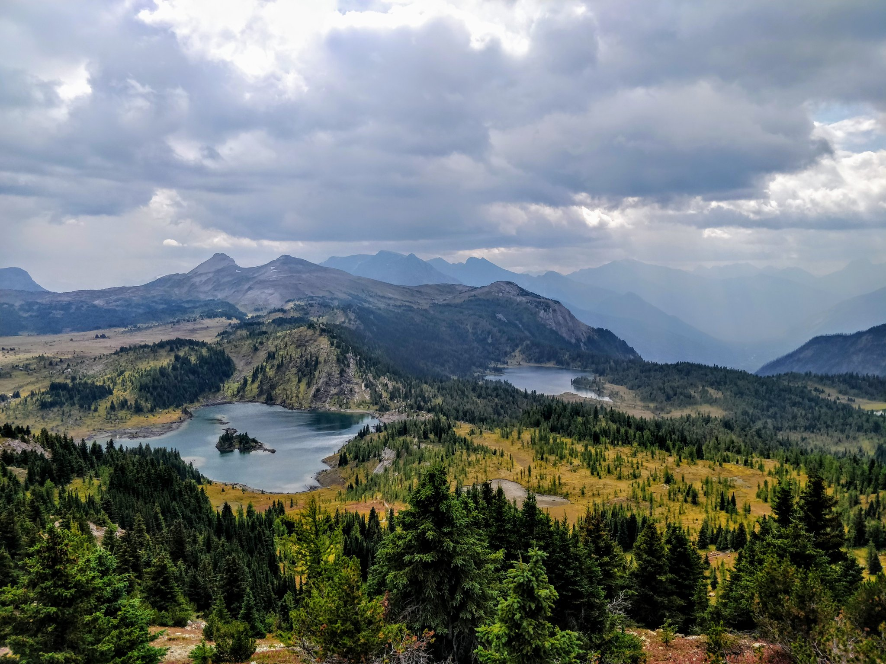
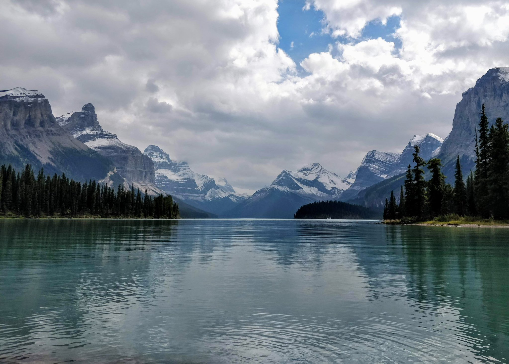
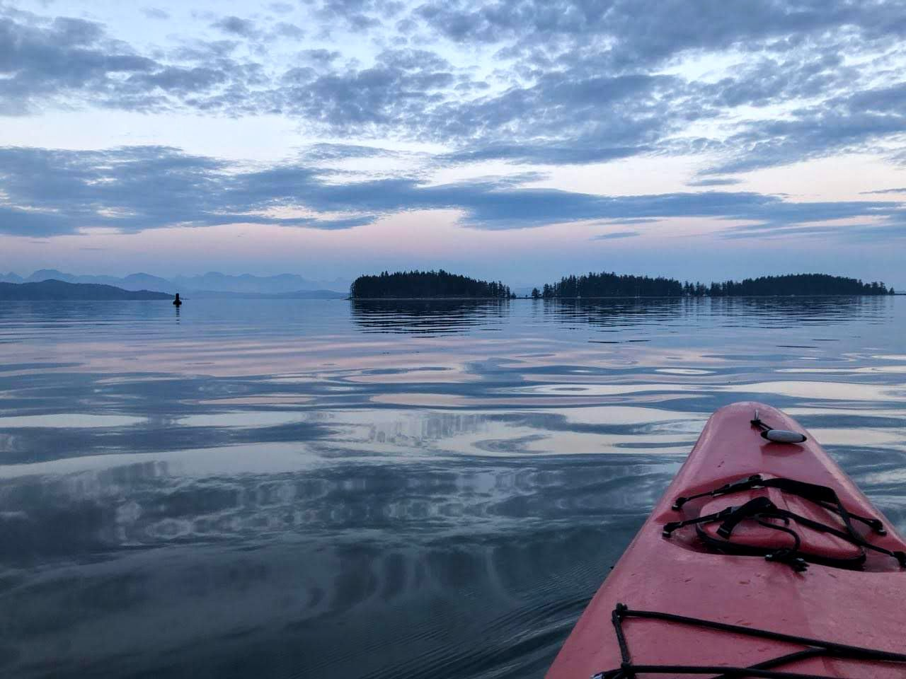

We spent 3 weeks in Canada, driving through the Rocky Mountains and up the east coast of Vancouver Island. If you're into lakes, mountains, sea, hiking, kayaking and animals, I'd highly recommend it. Chucking our itinerary up here as lots of people have asked for it.

## At a glance

* Land in Calgary, drive to Banff
* Banff 5 nights
* Jasper 3 nights
* Kamloops 1 night
* Whistler 1 night
* Drive + 2 ferries to Quadra Island (via Vancouver Island)
* Quadra Island 3 nights
* Port McNeill 4 nights
* Vancouver 1 night
* Fly back home from Vancouver
* We went **late August to early September** 

## In detail

### Driving, parks pass & other prep work

This is a driving trip - we drove over 2200km. Renting a 4-wheel-drive (you'll want one; Canadian cars are huge and roads can be gravelly) for three weeks cost us around £800. Petrol for the trip cost about £170.

You'll need a [Discovery Pass](https://www.pc.gc.ca/en/pn-np/ab/banff/visit/pass) for access to the National Parks. It's cheaper to buy the one for the whole year than individual entries - we bought ours at the [MEC outdoor store in Calgary](https://www.mec.ca/en/stores/calgary). You can also buy bear spray there (turns out bears aren't so cuddly).

For accommodation we used AirBnb for everything except Port McNeill, where the options were slim.

You'll want to book wildlife watching trips in advanced (many sell out months in advanced), but all other trips/activities were booked on the day/out there.

### Banff

We stayed in Canmore, which is just outside Banff National Park. It's stunning - mountains, lakes, beautiful walks. I'd also recommend the [The Secret Life of Canada](http://www.thesecretlifeofcanada.com/) podcast on Banff for insight into its complex (and often horrific and colonial) history.

* Lake Minnewanka Loop - a scenic drive which made the perfect first day introduction to Banff
* Lake Louise - hike to the Tea Houses
* Johnston Canyon
* Sunshine Meadows - this was one of our favourite hikes (despite being very easy) for its truly breathtaking views; would suggest a day the gondola is operating (Friday-Monday) as it's not much more expensive than the shaky old school bus alternative! 

### Icefields Parkway

You drive the Icefields Parkway between Banff and Jasper. Bring warm layers & definitely stop at:

* Bow Lake
* Peyto Lake (Bow Summit Lookout)
* Athabasca Falls
* Athabasca Glacier - we didn't plan ahead enough to do an [ice walk](http://www.icewalks.com/), but the scale is magnificent
* Anywhere that takes your fancy - it's all stunning

### Jasper

We stayed near central Jasper. 

* Maligne Lake - take the boat ride to Spirit Island (think this is best boat ride option of all the lakes), and stop at the Maligne Canyon on your way back
* Jasper Skytram - then walk up to the top of the mountain; steep but so worth it for the views!

### Kamloops

This was a really quick overnight stop for us, but [Peterson Creek Park](http://hikekamloops.ca/peterson-creek-park/) gives you a fantastic view over the city.

### Whistler

Whistler's a haven for snowboarding, mountain biking and climbing. For us the focus was the Sea to Sky Highway towards Nanaimo (where you'll cross to Vancouver Island). We stopped at the Brandywine & Shannon Falls, as well as various view points along the way.

### Quadra Island

We spend three nights on the relaxingly isolated Quadra Island (a 10 minute ferry ride from Cambell River). It's got a really well stocked little supermarket (think notably better than most metro stores in central London) and a book store, which, along with the walks and scenery, are all you need here.

* Rebecca Spit Marine Provincial Park
* [Sunset Sea Kayaking](http://www.quadraislandkayaks.com/day.html)

### Port McNeill & Wildlife Trips

Port McNeill is an old logging town that feels quite remote, but is the base for a number of wildlife trips - expect to see many binoculared bird watchers.

* [Sea Wolf Adventures: Grizzly Bears of the Wild](http://seawolfadventures.ca) - if you do one trip, make it this one; very small boat, max 12 guests, all day tour - we saw grizzly bears up close (from the safety of the boat), black bears, humpback whales, orcas, dolphins, a porpoise and sea lions
* [Mackay Whale Watching](http://whaletime.com)
* Sointula - a ferry ride from Port McNeill, Sointula is a seaside town that used to be a Finnish utopian commune. Yes, really. Going with a Finn = 100x more fun; a bit like bringing a minor celebrity.

### Vancouver

Vancouver seems an outrageously excellent city in which people walk charmingly well behaved dogs, jog by the sea, never litter and children sit and do their homework on park benches. Also, as a Londoner with a contactless credit card, the underground *just works*.

<blockquote class="twitter-tweet tw-align-center" data-lang="en">
Radio silence for three weeks as we&#39;ve been in Canada exploring the Rockies and Vancouver Island - from snow-capped mountains and lakes to sea and kayaks and whales. And no one got eaten by a bear! 🐻 <a href="https://t.co/9qAtLIK36D">pic.twitter.com/9qAtLIK36D</a>
&mdash; Jenny Brennan (@jennyhbren) <a href="https://twitter.com/jennyhbren/status/1040892095945486336?ref_src=twsrc%5Etfw">September 15, 2018</a></blockquote>

