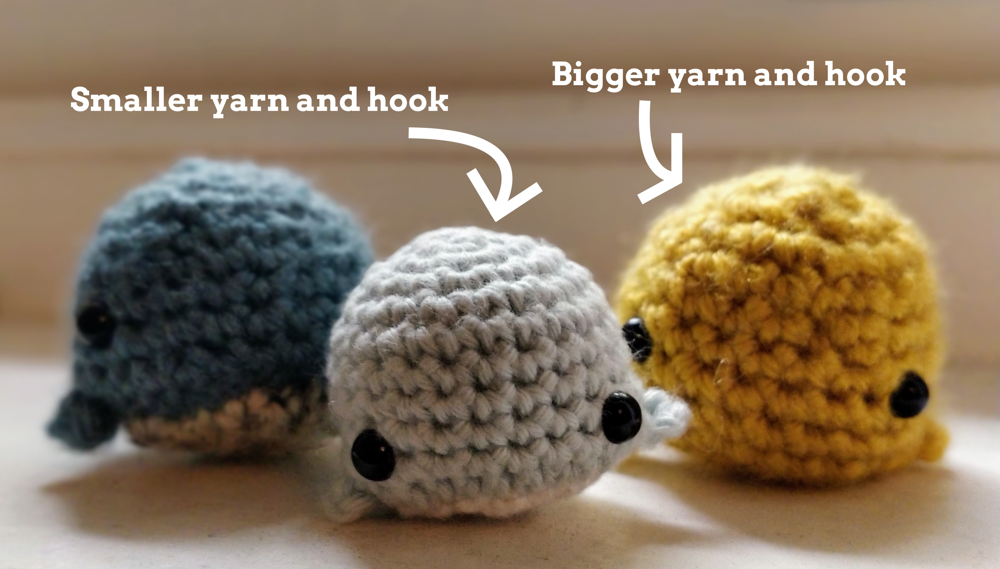

Amigurumi is the Japanese art of crocheting adorable small stuffed toys.

> **Ami** = crocheted or knitted
> 
> **Nuigurumi** = stuffed doll (made of sewn fabric)
> 
> **Amigurumi** = those words merged together to mean crocheted stuffed doll

I learnt to make cute tiny animals with this technique during the first COVID lockdown, having never crocheted or knitted before. I'm still very much a beginner, but friends have asked for tips and the resources I used:

## Picking a starter project

I'd suggest something simple to start with. To tell if it is simple: in general the closer it is to being a plain ball or oval shape, the easier it will be. For instance, [this jellyfish](https://www.hookedbyrobin.com/blog/2019/09/how-to-crochet-amigurumi-jellyfish.html) or a tiny chonky round whale.

I started with [this sea animals crochet kit](https://www.etsy.com/uk/listing/777667148/sea-animals-amigurumi-crochet-kit-bundle?ref=shop_home_active_2&frs=1&crt=1) from [Beardie & Blondie on Etsy](https://www.etsy.com/uk/shop/beardieandblondie?ref=simple-shop-header-name&listing_id=777667148). The patterns were easy enough for a first project, but I found the yarn (Ricorumi DK cotton) and hook (3.5mm) too small having never crocheted before. 4 hours in all I had was some tangled string. I ended up getting [bigger yarn](https://smile.amazon.co.uk/gp/product/B003D7UCJQ/ref=ppx_yo_dt_b_search_asin_title?ie=UTF8&psc=1) (Aran) and a [5.5mm hook](https://smile.amazon.co.uk/Clover-Amour-Crochet-Hook-Multicoloured/dp/B008J140U8/ref=sr_1_8?dchild=1&keywords=5.5mm+crochet+hook&qid=1604159820&s=kitchen&sr=1-8) instead and was then able to get the hang of it as I could see what I was doing better and it was less fiddly (I like to think the previous 4 hours of pain helped too). Once I'd made my first tiny whale with the bigger materials I found I was able to use the smaller yarn and hook just fine.

You could also just get the materials (listed below) and find a crochet pattern on the internet. I'd recommend finding a beginner pattern with a YouTube video, but have also listed YouTube videos I found helpful for all the basic techniques below.

## Materials

These are the materials you need to make most projects:

* Yarn (I started with acrylic Aran weight, before later being able to use the smaller cotton DK yarn - you can also scale up and use a bigger yarn and hook to make bigger versions)
* Crochet hook (I started witha 5.5mm with the heavier yarn, before later being able to use a 3.5mm or 3mm with the smaller yarn)
* A big blunt needle for sewing things together with yarn
* Something to mark your stitches (an earring or safety pin will do)
* 6mm plastic safety eyes or black thread to make eyes
* Some stuffing

## You can learn anything on YouTube

I used YouTube videos to learn every technique - but quality varies. These are the ones that worked for me:

* [Magic circle](https://www.youtube.com/watch?v=0yX0ZG4ef74) - most patterns start with making a tiny circle of crochet called a "magic circle" because amigurumi is generally crocheted "in the round" - which means in a spiral (instead of in straight rows), with each batch of stitches being called a round
* [Increasing into the magic circle](https://www.youtube.com/watch?v=8RKVclxwLcQ) - how you make your second round of stitches after you've done the magic circle i.e. make the circle bigger, known as "increasing"
* [Invisible decrease](https://youtu.be/n48a4rdgxtU) - how to neatly make the circle bigger, known as "decreasing 
* [Half double crochet stitch](https://youtu.be/LxA2osb5Qfk) - often used in making tiny arms or flippers or ears
* [Changing yarn colours](https://clubcrochet.com/crochet-stripes-perfectly-amigurumi/) - contains a few different ways of doing it depending on how much effort you want to put in to make it neat
